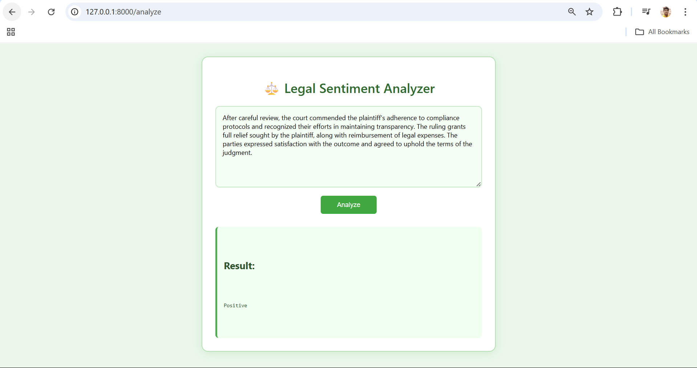

#  Legal Sentiment Analyzer 

Analyze legal documents to detect sentiment — **Positive**, **Negative**, or **Neutral** — using powerful transformer-based AI models.

---

##  Project Overview

The **Legal Sentiment Analyzer** is a web-based application designed to assist law firms, legal researchers, or compliance teams by automatically classifying the sentiment of legal text and providing concise summaries.

###  Features

-  Analyze legal text for sentiment using a transformer model (e.g., FLAN-T5)
-  Summarize lengthy legal passages
-  Upload `.txt` or `.csv` files for batch analysis
-  Clean UI (FastAPI + HTML + CSS)
-  Runs locally using FastAPI and HuggingFace Transformers

---

##  Screenshot

  

---

##  Tech Stack

- **Frontend**: HTML5, CSS3
- **Backend**: Python, FastAPI
- **Model**: HuggingFace Transformers (FLAN-T5 / Mistral)
- **Tools**: Uvicorn, Jinja2 Templates, Python-Multipart

---

##  Installation

1. **Clone the Repository**

   ```bash
   git clone https://github.com/yourusername/IBM_project_repo.git
   cd legal-sentiment-analyzer
---   
2. **Install Dependencies**
   ```bash
   pip install -r requirements.txt
---

3. **Run the Application**
   ```bash
   python -m uvicorn app:app --reload
---
4. **Open in Browser**
	Go to: [http://127.0.0.1:8000](http://127.0.0.1:8000)
